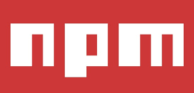
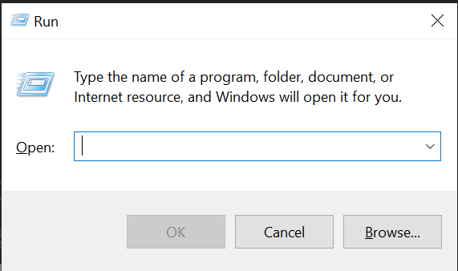
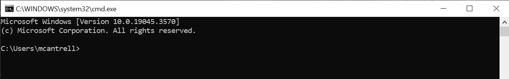
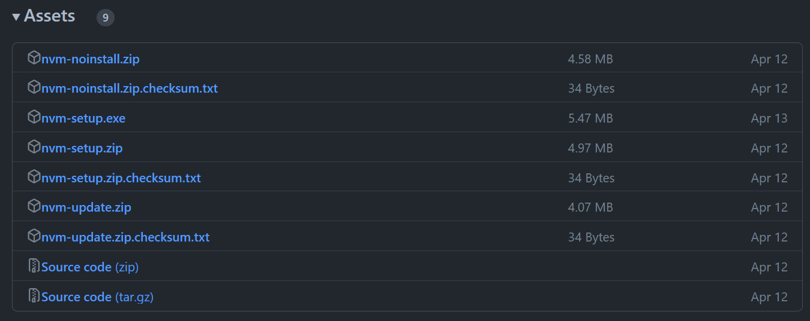

# Stelle, An AI Powered Code Asisstant

Stelle is an assistant powered by artificial intelligence to help you become a better programmer! Stelle, while still in early development, can answer code-related questions and even help evaluate code you provide.

## Quick Links

- [Requirements](#requirements)
- [Features](#features)

## Requirements

Stelle uses dependencies to bring you a useful coding assistant. Listed below are the required dependencies to run Stelle:

### 'openai'


This is the library from OpenAI, creators of ChatGPT which Stelle uses to generate responses for the user.

Don't fret if you do not have these dependencies on your device already! Stelle's built-in dependency manager will handle the installation of dependencies, as long as you have [npm](#npm).

---

### 'npm'



npm is the Node Package Manager that comes with installations of NodeJS. Many dependencies for Stelle are NodeJS packages, so npm is essential to fully using and accessing Stelle's capabilities!

By following [this link](https://docs.npmjs.com/downloading-and-installing-node-js-and-npm), you can access npm's documentation on how to install npm.

Alternitavely, see [Installing npm](#installing-npm). 

## Features

Stelle has a few core features as of its release! Some of these features are:

- Helping With Several Coding Languages
- Fixing, Optimizing, and Analyzing Code
- Inserting Code and Comments Into Your Editor

Many more features are underway! Feel free to leave feedback about current features or suggestions for more to come!

## Installing npm

npm is often installed with NodeJS. First, let's check if you have NodeJS and npm already installed on your system!

### Opening The Run Window
- On Windows systems, you'll do this by pressing the `Windows Key + R`.<br><br>
<br>
```This window should appear once you do! This is the "Run" window which we will use to access the command prompt.```
<br><br>

### Opening The Command Prompt
- In the textbox, type `cmd` and press the Enter key.<br><br>

```This is the command prompt! Now we can check if we already have NodeJS or npm.```
<br><br>

### Checking For npm

- Within the command prompt, type `npm -v`.<br><br>

```If you do not receive this or something similar, you do not have npm installed.```

### What To Do From Here

Now that we've checked if npm is on your current system, we can go one of two ways:

- If you got a response from `npm -v` that indicated a version, good job! You have npm and can use Stelle!<br><br>
- If you didn't get a response from `npm -v` that indicated a version, please go to [this Github link](https://github.com/coreybutler/nvm-windows/releases) and scroll down until you see a tab labelled `assets`.<br><br>

Select the `nvm-setup.exe` file which will begin downloading it. Once it is downloaded, run it and go through the set-up menus. More often than not, you can just press `Next` or `Okay`.<br><br>

- Once you've run the installer, open the command prompt again. Type `nvm` and press enter to execute the command.<br><br>

```If you receive this screen or something similar, nvm is installed on your device!```

- Lastly, once you have nvm installed and are still in the command prompt, type `nvm install node` and press enter.<br><br>


### Now congratulate yourself for installing npm and go use Stelle!